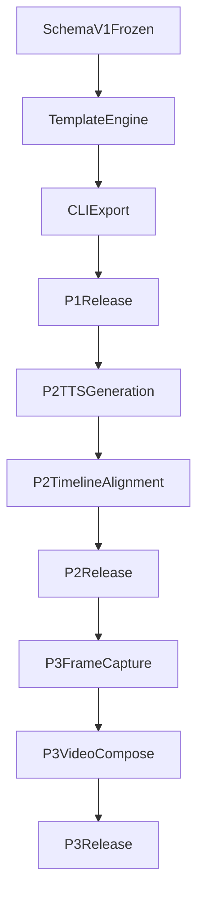

# Deck-AV Integration Epic（执行版）

> 来源基线：[`docs/PRD-HTML-Deck-AV-Integration.md`](./PRD-HTML-Deck-AV-Integration.md)  
> 目标：将 PRD 拆解为可直接分配的 Epic -> Story -> Sub-task，并按 Story 驱动编码、测试与上线。

---

## 1) Epic 定义

- Epic Key（建议）：`DECK-EPIC-001`
- Epic 名称：`Deck-AV Integration (HTML Deck -> TTS Timeline -> MP4)`
- Epic 目标：
  - 在仓库内新增 `podcast_deck/` 子包，分三期交付 HTML 幻灯、TTS 时间轴联动和 MP4 合成。
  - 不侵入现有 `podcast_creator` 主流程（LangGraph 节点保持兼容）。
- Epic 完成标准：
  - P1/P2/P3 全部 Story 达成 AC。
  - 关键 ADR（001~007）全部满足。
  - 每期可独立发布，且有可验证回滚路径。

## 2) Epic 约束（来自 PRD ADR）

- ADR-001：同仓独立子包，避免侵入 `nodes`/`graph.py`。
- ADR-002：源码多文件，交付单文件 HTML。
- ADR-003：调试能力仅开发态门控，release 构建剔除调试脚本。
- ADR-004：Schema v1.0 最小字段集先行。
- ADR-005：二期时间切片为主，容差 ±500ms。
- ADR-006：三期采用停留帧 + 转场帧，不做逐帧 30fps。
- ADR-007：字幕优先 `ffmpeg` 内建 filter，不引入 PIL。

---

## 3) Story Backlog（可分配）

### 3.1 P1（MVP）Story（6 个）

| Story ID | Story 名称 | 主要交付 | AC（验收标准） | 估算（人日） |
|---|---|---|---|---|
| P1-S1 | 子包与 CLI 骨架 | `podcast_deck` 目录、`cli.py` 命令入口 | `python -m podcast_deck export --input ... --output ...` 可执行 | 1.0 |
| P1-S2 | Schema v1.0 解析与校验 | `schema.py`、最小字段校验与错误提示 | 可解析 PRD 定义字段；非法输入有可读错误 | 1.0 |
| P1-S3 | 模板构建与单文件导出 | `exporter.py`、模板与样式聚合 | `file://` 可开；无外链请求；HTML < 100KB（不含音视频） | 1.5 |
| P1-S4 | 交互与打印/PDF | 键盘翻页、`@media print` 样式 | Arrow/Home/End 可用；Chromium 打印分页正确 | 0.5 |
| P1-S5 | 调试面板与生产剔除 | `?debug=1` 开关、高亮与复制 CSS、release 剔除 | debug 模式可用；release 产物无调试脚本/标记字符串 | 1.0 |
| P1-S6 | Streamlit 入口集成 | UI 增加 Export Deck 按钮 | 与 CLI 产物一致，调用同一导出逻辑 | 0.5 |

> P1 汇总估算：`5.5` 人日（与 PRD Likely 对齐）

### 3.2 P2（TTS + 时间轴）Story（5 个）

| Story ID | Story 名称 | 主要交付 | AC（验收标准） | 估算（人日） |
|---|---|---|---|---|
| P2-S1 | Edge-TTS 分页旁白生成 | 复用语音工厂生成分页音频 | 给定 deck 可生成分段音频，命名与 slide id 对齐 | 2.0 |
| P2-S2 | SRT 对齐工具选型与封装 | aeneas/Whisper 评估与封装适配层 | 输出统一时间轴结构，含工具选择结论与回退策略 | 2.0 |
| P2-S3 | 时间切片与权重算法 | 总时长切片/字数加权分配逻辑 | 自动翻页偏差控制在 ±500ms（抽样集） | 1.5 |
| P2-S4 | 时间轴驱动翻页与无障碍 | JS 按时间轴切页，`aria-live` 更新 | 自动播放与切页稳定，辅助技术可感知页码变化 | 1.5 |
| P2-S5 | 音频嵌入与时长回填 | `<audio>` 嵌入与 `durationHintSec` 回填 | schema 可回填时长；播放与翻页一致 | 1.0 |

> P2 汇总估算：`8.0` 人日（在 PRD 6~10 区间内）

### 3.3 P3（MP4 合成）Story（5 个）

| Story ID | Story 名称 | 主要交付 | AC（验收标准） | 估算（人日） |
|---|---|---|---|---|
| P3-S1 | Headless 截帧管线 | 停留帧 + 转场帧捕获 | 给定 deck 能稳定导出帧序列 | 2.0 |
| P3-S2 | FFmpeg 拼接与转场 | concat + xfade 脚本与参数策略 | 输出 MP4 可播放，转场时长受控 | 2.0 |
| P3-S3 | 字幕叠层 | `drawtext` / `subtitles` 集成 | 字幕时序与时间轴一致，可配置样式 | 1.5 |
| P3-S4 | 旁白+BGM 混音 | 旁白、BGM、loudnorm 串接 | 最终音轨响度符合配置，听感稳定 | 1.5 |
| P3-S5 | 并发与资源控制 | Chrome 并发、临时目录、I/O 限流 | 大页数场景资源可控，无明显崩溃/超时 | 1.5 |

> P3 汇总估算：`8.5` 人日（在 PRD 8~12 区间内）

---

## 4) 依赖与并行策略

- 可并行：
  - `P1-S2`（Schema）与 `P1-S3`（模板）并行，最终在 `exporter` 汇合。
  - `P2-S1`（音频生成）与 `P2-S2`（对齐选型）并行。
  - `P3-S3`（字幕）与 `P3-S4`（混音）在 `P3-S2` 基础上并行。
- 串行关键路径：Schema -> Export -> Timeline -> Video。

---

## 5) Story 执行模板（编码 / 测试 / 上线）

每个 Story 严格按以下模板执行，避免“开发完成但不可发布”。

### 5.1 编码清单

- 分支：`feat/deck-<phase>-<story-id>`
- PR 范围：单 Story 单 PR，避免跨 Story 混改。
- 代码约束：
  - 不改 PRD 与计划文档。
  - 优先抽离可测试函数（schema/算法/管线拼接）。
  - 不破坏现有 `podcast_creator` 默认路径。

### 5.2 测试清单

- 单元测试：
  - Schema 解析与异常。
  - 导出器拼装结果（HTML 关键节点）。
  - 时间切片算法、帧/字幕参数计算。
- 集成测试：
  - CLI E2E 产物验证。
  - release/debug 构建差异断言（调试脚本剔除）。
  - 打印/PDF（Chromium 基线）抽样验证。
- 回归测试：
  - 不影响既有语音 provider、既有播客生成路径。
  - 文件体积、资源请求、参数兼容性不回退。

### 5.3 上线清单

- 发布前：
  - Story AC 全勾选。
  - 风险登记册 R1~R6 逐项复核。
  - 更新变更说明（包含兼容性与已知限制）。
- 发布后：
  - 抽样验证产物可用。
  - 记录问题与后续修复 Story（不混入已发布 Story）。
- 回滚：
  - 保留上一期稳定命令入口与参数兼容。
  - 如出现高优故障，回切到前一期版本能力。

---

## 6) 里程碑与发布节奏

| 里程碑 | 发布范围 | 进入条件 | 发布后验证 | 回滚策略 |
|---|---|---|---|---|
| M1 | P1（HTML Deck MVP） | 6 个 P1 Story 全部 Done；MVP AC 通过 | `file://`、打印 PDF、debug/release 行为 | 回滚到无 deck 能力版本，不影响主流程 |
| M2 | P2（TTS+时间轴） | 5 个 P2 Story Done；时间轴误差在容差内 | 自动播报+自动翻页稳定；a11y 事件有效 | 保留手动翻页路径，禁用自动时间轴 |
| M3 | P3（MP4 合成） | 5 个 P3 Story Done；性能与资源门限达标 | MP4+字幕+混音抽样验证 | 回退到 P2（仅 HTML+音频时间轴） |

---

## 7) 建议 Sub-task 模板（复制即用）

每个 Story 下创建固定 6 个子任务：

1. 需求澄清与接口定义  
2. 编码实现  
3. 单元测试  
4. 集成/回归测试  
5. 文档与使用说明  
6. 发布验证与复盘

---

## 8) 建议负责人角色分配（可选）

- `Frontend/Template`：P1-S3/S4/S5
- `Core Python/CLI`：P1-S1/S2/S6
- `Audio/TTS`：P2-S1/S3/S5
- `Alignment/Timeline`：P2-S2/S4
- `Video Pipeline`：P3-S1/S2/S3/S4/S5

> 若团队人力有限，优先保证关键路径角色稳定（Schema/Export、Timeline、Video Pipeline）。

---

## 9) 当前执行进展（实时）

### 9.1 已完成（P1 + P2）

- P1-S1 ~ P1-S6：已完成（CLI 骨架、Schema、单文件导出、交互打印、debug/release 门控、Streamlit 集成）。
- P2-S1 ~ P2-S5：已完成（分页 TTS、对齐适配层、时间切片、自动翻页与 `aria-live`、音频嵌入与时长回填）。
- 单测：`uv run pytest podcast_deck/tests -q` 已通过（当前 `42 passed`）。

### 9.1.1 P3 当前进展（进行中）

- ✅ P3-S1 已完成：实现 `capture-frames` 管线（静态页图 + 停留帧 + 转场帧 + `frame_manifest.json`）。
- ✅ P3-S2 已完成：实现 `render-video`（基于 ffmpeg 将帧序列编码为 MP4）。
- ✅ P3-S3 已完成：实现字幕叠层（优先 `subtitles`，回退 `drawtext`，并在双过滤器缺失时降级无字幕继续渲染）。
- ✅ P3-S4 已完成：实现音频 mux（`--audio`、`--audio-codec`、`--audio-bitrate`、`--audio-shortest`）。
- ✅ P3-S5 已完成：实现一键流水线 `synth-video`（`capture-frames + render-video`）。
- ✅ P3-S6 已完成：文档收口（README 与 Epic 执行文档同步 `synth-video`、字幕回退策略、workspace 清理策略）。
- ✅ P3 本地 E2E 样例已通过：
  - `uv run python -m podcast_deck capture-frames --input output/decks/p3-e2e/deck.json --workspace output/decks/p3-e2e/workspace --fps 10 --hold-sec 1.0 --transition-sec 0.5`
  - `uv run python -m podcast_deck render-video --workspace output/decks/p3-e2e/workspace --output-mp4 output/decks/p3-e2e/workspace/deck.subtitle.audio.mp4 --fps 10 --crf 20 --preset veryfast --subtitle-mode burn --audio output/decks/p3-e2e/workspace/narration.test.wav`
  - `uv run python -m podcast_deck synth-video --input output/decks/p3-e2e/deck.json --workspace output/decks/p3-e2e/synth-workspace --fps 10 --hold-sec 1.0 --transition-sec 0.5 --subtitle-mode burn --audio output/decks/p3-e2e/workspace/narration.test.wav --output-mp4 output/decks/p3-e2e/synth-workspace/deck.synth.mp4 --crf 20 --preset veryfast`
  - `uv run python -m podcast_deck synth-video --input output/decks/p3-e2e/deck.json --workspace output/decks/p3-e2e/synth-clean-workspace --fps 10 --hold-sec 1.0 --transition-sec 0.5 --subtitle-mode burn --audio output/decks/p3-e2e/workspace/narration.test.wav --output-mp4 output/decks/p3-e2e/synth-clean-workspace/deck.synth.clean.mp4 --crf 20 --preset veryfast --clean-workspace`
  - 产物：
    - `output/decks/p3-e2e/workspace/deck.subtitle.audio.mp4`
    - `output/decks/p3-e2e/synth-workspace/deck.synth.mp4`
    - `output/decks/p3-e2e/synth-clean-workspace/deck.synth.clean.mp4`（目录仅保留最终 MP4）

### 9.2 P2 端到端真实样例验证（已通过）

- 输入样例：`output/decks/p2-e2e/deck.json`
- 执行命令：
  - `uv run python -m podcast_deck narrate --input output/decks/p2-e2e/deck.json --output-html output/decks/p2-e2e/deck.narrated.html --workspace output/decks/p2-e2e/workspace --tts-provider edge_tts --tts-model edge-1 --voice zh-CN-XiaoxiaoNeural --timeline-strategy weighted_chars`
- 结果：
  - `✅ Narrated deck exported: output/decks/p2-e2e/deck.narrated.html`
  - `🎧 Narration audio: output/decks/p2-e2e/workspace/narration.mp3`
  - `🕒 Alignment method: fallback_timeline, cues: 3`
  - `📝 Backfilled JSON: output/decks/p2-e2e/workspace/deck.with_duration.json`
- 产物检查：
  - HTML 存在，包含 `id="deck-audio"` 与时间轴脚本 `const cues =`
  - 音频文件存在（`narration.mp3`）
  - `durationHintSec` 已回填（`[4.011, 6.37, 3.539]`）

### 9.3 当前待办（发布闭环）

- 推送分支：`feat/deck-mvp-export-integration` 到 `origin`（需先完成本机 GitHub 认证）。
- 创建 PR（包含 P1 + P2 + P3），并在 Test plan 中保留上述 E2E 记录。
